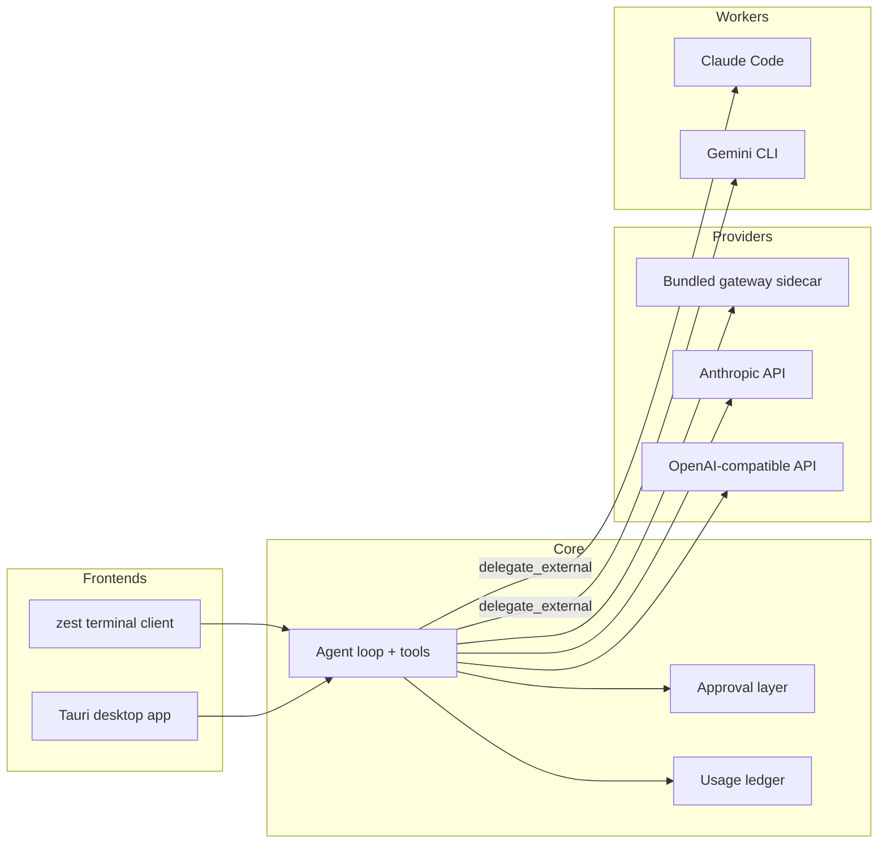

<div align="center">


# Zest

**A provider-aware, local-first coding harness, built in Rust.**

Run a coding agent in your project: stream responses, read and edit files, run
commands, and delegate bounded work to external CLIs — with approvals, visible
diffs, and honest usage accounting at every step.

[](https://github.com/LemonMantis5571/Zest/actions/workflows/windows-verify.yml)
[](https://github.com/LemonMantis5571/Zest/actions/workflows/linux-verify.yml)
[](LICENSE)

</div>

---

## What is Zest?

Zest is a coding harness: the agent loop, tools, and permission layer that sit
between you and a large language model. One Rust core powers two frontends — a
Tauri desktop app and a terminal REPL — so the same sessions, tools, approvals,
and usage records work in both.

You bring your own model account. Zest never routes your prompts through a
middleman, has no accounts of its own, and records your usage locally so you
can see what a session actually cost.

## Features

- **One core, two frontends** — a shared `zest-core` agent loop drives both the
  desktop app and the `zest` terminal client.
- **Bring your own parent session** — Codex or Claude through the bundled
  gateway, the native Anthropic API, or any OpenAI-compatible endpoint
  (OpenAI, DeepSeek, local servers).
- **Streaming with effort control** — token-by-token responses with
  `low`–`max` reasoning effort, so you choose how much the model thinks.
- **Approvals with diff previews** — writes, shell commands, and worker
  delegations pause for your explicit `y/N` and show what will change.
- **Explicit worker delegation** — hand bounded subtasks to already-authenticated
  Claude Code or Gemini CLI workers, run in isolated Git worktrees, and review
  their diffs before accepting anything.
- **Context management that is honest** — a live context meter, automatic
  compaction at 80% of the window, and checkpoints that survive a restart.
- **Honest usage ledger** — local token and cost records per provider and model,
  with estimates clearly separated from provider-reported figures.
- **Headless JSONL protocol** — run a single deny-only turn for editors and CI
  with `zest run --jsonl`.
- **Local-first** — no remote Zest servers, no telemetry, no accounts. Secrets
  stay in your OS credential manager.

## How it works



The parent conversation runs against the provider you selected. The bundled
`CLIProxyAPI` sidecar translates subscription-backed providers (Codex, Claude)
locally and is started and supervised by Zest. External workers are an explicit
process boundary: they are configured, signed in, and approval-gated — never
an automatic fallback.

## Getting started

### Install

Download a release for your platform from
[GitHub Releases](https://github.com/LemonMantis5571/Zest/releases).

- **Windows** — the `.msi` or `.exe` installer. If Windows Firewall prompts,
  allow local loopback so the desktop app can talk to its bundled gateway.
- **Linux** — the `.deb`, `.rpm`, or AppImage package:

  ```bash
  sudo dpkg -i ./zest_0.1.0_amd64.deb    # Debian / Ubuntu
  sudo rpm -i ./zest-0.1.0-1.x86_64.rpm  # Fedora / openSUSE
  ./Zest_0.1.0_amd64.AppImage
  ```

> [!TIP]
> Verify a downloaded artifact against the release checksums with
> `Get-FileHash` (Windows) or `sha256sum` (Linux) — every release ships a
> `SHA256SUMS` file.

### Build from source

Prerequisites: **Rust 1.97.1** (pinned in `rust-toolchain.toml`), **Node.js
24.16.0+** and **npm**, **Git**, and **PowerShell** (Windows PowerShell 5.1+ or
`pwsh` 7+) for the gateway and verify scripts.

- **Windows** — Visual Studio Build Tools (C++ workload with Windows SDK) and
  the WebView2 Evergreen runtime (included with Windows 10/11).
- **Linux** (Debian/Ubuntu names; other distros ship the same libraries):

  ```bash
  sudo apt install build-essential pkg-config libssl-dev cmake \
    libwebkit2gtk-4.1-dev libayatana-appindicator3-dev librsvg2-dev \
    libdbus-1-dev libxdo-dev patchelf tar
  ```

Then, from the repository root:

```bash
npm ci                                  # JavaScript dependencies
./scripts/fetch-gateway.ps1             # fetch the pinned gateway sidecar
npm run ui:build                        # build the web UI
cargo run -p zest-desktop               # desktop app
cargo run -p zest                       # terminal client
```

On Linux or macOS, invoke the PowerShell scripts with `pwsh ./scripts/...`.
Use `-Target <rust-target-triple>` to fetch the sidecar for a platform other
than the host, and `-Check` to verify an existing one.

> [!NOTE]
> Release builds bundle the gateway sidecar, so `cargo tauri build` requires
> the pinned binary for the target platform to be present first.

## Quick start

### Desktop

1. Launch Zest and pick a provider — **Codex** (ChatGPT sign-in through the
   bundled gateway) or an **API key** provider configured in Settings.
2. Open a project folder, start a chat, and ask for a change. Writes and shell
   commands pause for your approval with a diff preview.
3. Keep an eye on the context meter; compaction is automatic at 80%.

Useful shortcuts (all rebindable from Settings):

| Shortcut | Action |
| --- | --- |
| `Ctrl+K` | Command palette |
| `Ctrl+N` | New chat |
| `Ctrl+B` | Toggle chat history |
| `Ctrl+Shift+U` | Usage screen |
| `Ctrl+Shift+M` | Switch provider |

### Terminal

```bash
zest                  # start the interactive REPL
zest auth             # show provider authentication status
zest usage            # show local usage totals and last-30-day cost
zest doctor --live    # opt-in live check: streaming, tools, ledger, persistence
```

> [!WARNING]
> `zest doctor --live` makes one real provider call and spends quota. It is a
> manual acceptance check, not something to wire into CI.

## Configuration

Zest creates the user-level config at `~/.zest/zest.toml` on first launch. A
project can override it with a local `zest.toml` (start from
`zest.toml.example`). Secrets never belong in either file — API keys live in
your OS credential manager (Windows Credential Manager, macOS Keychain, or
Linux Secret Service), and subscription sign-ins stay with the vendor CLI.

```toml
[providers.codex]
kind = "gateway"
base_url = "http://127.0.0.1:8317"
api_key_env = "ZEST_GATEWAY_KEY"
model = "gpt-5.6-terra"

[default]
provider = "codex"
model = "gpt-5.6-terra"
```

OpenAI-compatible providers are configured the same way, with their keys stored
in the credential manager instead of the file:

```toml
[providers.deepseek]
kind = "openai_compatible"
base_url = "https://api.deepseek.com"
model = "deepseek-v4-flash"
credential = "deepseek"
```

Environment overrides:

| Variable | Purpose |
| --- | --- |
| `ZEST_GATEWAY_KEY` | Client token the bundled gateway accepts |
| `ZEST_BASE_URL` | One-off gateway origin override (no `zest.toml` edit) |
| `ZEST_MODEL` | Default model for override sessions |
| `ZEST_EFFORT` | Default reasoning effort (`low`–`max`) |

## Delegating to external workers

For bounded subtasks, Zest can delegate to an external CLI that is already
signed in — currently Claude Code and Gemini CLI — over ACP or a headless
invocation. The worker runs in an isolated Git worktree by default and its
answer and diff come back for your review; the delegation itself still needs
your approval.

```toml
[agents.claude]
mode = "headless"
command = "claude"
args = ["--print", "--output-format", "stream-json", "--strict-mcp-config", "--model", "{model}", "{prompt}"]
model = "sonnet"
allow_mcp = false
workspace = "isolated"
```

The worker model is independent of Zest's chat model — choose **CLI default**
to let the vendor CLI decide.

> [!WARNING]
> MCP pass-through is off by default. Enabling it lets a worker use the MCP
> servers already configured in its own CLI; Zest does not manage those servers
> or review individual MCP calls.

## Headless mode

`zest run` executes one turn over a line-delimited JSON protocol
(`zest-jsonl-v1`), designed for editors and CI. Approvals are reported and
denied rather than waiting on a prompt, so the run is deterministic.

```bash
echo "Summarize README.md" | zest run --jsonl
```

Events on stdout: `session`, `text`, `thinking`, `tool_call_start`,
`tool_call_update`, `tool_call_result`, `approval_needed`, `question_needed`,
`model_substituted`, `done`, `error`.

## Usage ledger

Every turn is metered locally per provider and model: requests, input and
output tokens, and cache hits. Cost is priced from a local rate table (the
published LiteLLM table, cached for a day, with a `prices.toml` override
layer) and from token counts that Claude Code and Codex record in their own
transcripts.

Cost figures are an **estimate at list API rates**, not a bill — Zest has no
billing relationship with any provider. Where a CLI records what it was
actually charged, that figure is used and labelled as reported.

## Supported platforms

| Platform | Status |
| --- | --- |
| Windows 10/11 (x64, ARM64) | Primary target, verified on every push |
| Linux (x64, ARM64) | Supported, verified on every push |
| macOS | Keychain and file-open paths exist; not yet CI-verified |

## Documentation

- [Design](DESIGN.md) — product and architecture notes
- [Project context](PROJECT_CONTEXT.md) — goals, constraints, and glossary
- [Contributing](CONTRIBUTING.md) — development and verification workflow
- [Changelog](CHANGELOG.md) — user-facing changes
- [Security](SECURITY.md) — reporting vulnerabilities
